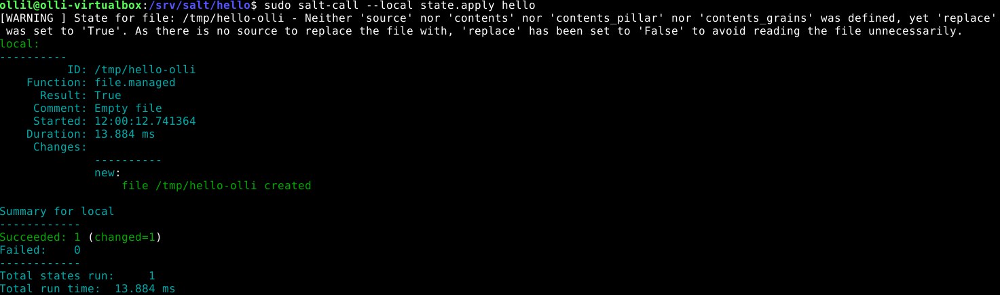

## h2 Infraa koodina

**x) Lue ja tiivistä. (Tässä x-alakohdassa ei tarvitse tehdä testejä tietokoneella, vain lukeminen tai kuunteleminen ja tiivistelmä riittää. Tiivistämiseen riittää muutama ranskalainen viiva.)**

Karvinen 2014: Hello Salt Infra-as-Code (https://terokarvinen.com/2024/hello-salt-infra-as-code/) 

- Tässä ohjeessa luodaan Salt-konfiguraatiojärejstelmän "Hello World" -ohjelma
- init.sls on tärkeä luoda jos haluaa tehdä YAML on Salt-tiedostojen oletusrenderöijä, joka muuntaa YAML-datasta Python-datastruktuureja koodina
- pkg, file, service, user ja cmd ovat muita tilafunktioita joita voi myös hyödyntää

Salt contributors: Salt overview (https://docs.saltproject.io/salt/user-guide/en/latest/topics/overview.html#rules-of-yaml)

- YAML on Salt-tiedostojen oletusrenderöijä, joka muuntaa YAML-datasta Python-datastruktuureja
- Ei saa käyttää tabulaattoria, ainoastaa välilyöntejä
- Kommentit alkavat #-merkillä
- Kolme peruselementtiä ovat scalars, lists ja dictionaries
- Sisennyksellä (tyypillisesti 2 välilyöntiä) määritellään rakennetta

Salt contributors: The top file (https://docs.saltproject.io/en/latest/ref/states/top.html)

- Top file sijaitsee aina tila-tiedostojen hakemistorakenteen huipuilla
- Kolme pääkomponenttia ovat environment, target ja state files
- Ympäristöt sisältävät kohteita ja kohteet sisältävät tiloja

**a) Hei infrakoodi! Kokeile paikallisesti (esim 'sudo salt-call --local') infraa koodina. Kirjota sls-tiedosto, joka tekee esimerkkitiedoston /tmp/ -kansioon.**

Aloitin tämän harjoituksen tekemisen 31.10.2025 klo 11:46. omassa kodissani. Koneenani toimi Lenovon V14 Gen 4 kannettava tietokone. Käytin apunani Tero Karvisen ohjetta **Hello Salt Infra-as-Code
** (https://terokarvinen.com/2024/hello-salt-infra-as-code/)./

Aloitin tarkistamalla että salt on asennettuna komennolla
```
salt --version
```
Sain tulokseksi **salt 3007.8 (Chlorine)**.

Ensimmäiseksi loin kansion **hello** polkuun /srv/salt
```
sudo mkdir -p /srv/salt/hello/
```
Tämän jälkeen tarkistin onko kyseinen kansio olemassa menemällä sinne
```
cd /srv/salt/hello/
```
Tämän jälkeen oli aika luoda ja editoida init.sls tiedostoa. Tämä onnistuu komennolla
```
sudoedit init.sls
```
On tärkeää olla kyseissä kansiossa niin init.sls menee oikeaan paikkaan. Kirjoitin tidostoon seuraavat tiedot:
```
/tmp/hello-olli:
  file.managed
```

Tämän jälkeen painoin ctrl + X ja tallensin painamalla Y-näppäintä. Tämän jälkeen oli aika kokeilla onnistuiko tämä ajamalla:
```
sudo salt-call --local state.apply hello
```

Uusi tiedosto **hello-olli** luotiin kohteeseen /tmp. Succeeded: 1 ja changed=1. Yksi tila onnistui ja yhteen tehtiin muutoksia. 


**b) Toppping. Tee top-file, niin että kaikki omat tilasi ajetaan kerralla komennolla 'sudo salt-call --local state.apply'.**

Loin top.sls tiedoston hakemistoon /srv/salt
```
sudoedit top.sls
```
Kirjoitin kyseiseen tiedostoon seuraavasti:
```
base:
  '*':
    - ollil
    - hello
```
ollil luo tiedoston hello-infra kohteeseen /tmp. Olin luonut tämän aikasemmin tunnilla. 

Seuraavaksi suoritin komennon 
```
sudo salt-call --local state.apply
```

Kaikki sujui niinkuin pitikin. 

**c) Viisikko tiedostossa. Tee erilliset esimerkit kustakin viidestä tärkeimmästä tilafunktiosta pkg, file, service, user, cmd. Kirjoita esimerkit omiksi tiloikseen /srv/salt/ alle, esim /srv/salt/hellopkg/init.sls.**

Aloitetaan tilafunktiosta pkg.

Loin /srv/salt kansioon hellopkg kansion ja siirryin sinne.
```
sudo mkdir -p /srv/salt/hellopkg/
cd /srv/salt/hellopkg/
```
Tein init.sls tiedoston komennolla
```
sudoedit init.sls
```

Kirjoitin tiedstoon seuraavasti:
```
httpie:
  pkg.installed
```
Tämä asentaa httpie paketin kun seuraava komento ajetaan:
```
sudo salt-call --local state.apply hellopkg
```
Komennon ajamisessa kesti hetken mutta se onnistui lopulta. Httpie vaati monta pyhton kirjastoa toimiakseen joten nekin piti ladata. 
Succeeded: 1 (changed=1).\
Testasin vielä mikä versio httpiestä minnulla oli:
```
http --version
```
Vastaukseksi tuli **3.2.4**\


Seuraavaksi vuorossa oli tilafunktio file. Olinkin tämän tehnyt jo aiemmin niin ajoin uudestaan komennon:
```
sudo salt-call --local state.apply hello
```
Tämä onnistui ja mitään muutoksia ei tehty, koska olin ajanut kyseisen komennon jo ylempänä. Succeeded: 1.

Seuraavaksi vuorossa oli tilafunktio service.
Loin kansion ja menin sinne
```
sudo mkdir -p /srv/salt/helloservice/
cd /srv/salt/helloservice/
```
loin sudoedit init.sls komennolla tiedoston ja kirjoitin sinne:
```
ufw:
  service.running
```

Ajoin komennon:
```
sudo salt-call --local state.apply helloservice
```
Tämä onnistui. Koska palomuuri oli jo päällä, kommentiksi tuli "The service ufw is already running" Succeeded: 1\

Seuraavaksi oli vuorossa user-tilafunktio.\
Loin kansion ja menin sinne:
```
sudo mkdir -p /srv/salt/hellouser
cd /srv/salt/hellouser/
```
Loin komennolla sudoedit init.sls tiedoston ja kirjoitin sinne:
```
katri:
  user.present
```
Tähän olisi voinut antaa muitakin tietoja esim kokonimi, salasana ja työpuhelin mutta jätin nämä tällä kertaa tyhjäksi.\

Ajoin komennon
```
sudo salt-call --local state.apply hellouser
```
Comment: New user was created. Käyttäjä **Katri** luotiin. Succeeded: 1 (Changed=1).

Viimeisenä vuorossa oli tilafunktio cmd. Loin kansion ja siirryi sinne
```
sudo mkdir -p /srv/salt/hellocmd
cd /srv/salt/hellocmd/
```
Tein komennolla sudoedit init.sls tiedoston ja muokkasin sitä:
```
touch /tmp/foo:
  cmd.run:
    - creates: /tmp/foo
```
Seuraavaksi ajoin komennon 
```
sudo salt-call --local state.apply hellocmd
```
Komento suoritettiin koska /tmp/foo ei ollut olemassa. Succeeded: 1 (changed=1). 


**d) Tee sls-tiedosto, joka käyttää vähintään kahta eri tilafunktiota näistä: package, file, service, user. Tarkista eri ohjelmalla, että lopputulos on oikea. Osoita useammalla ajolla, että sls-tiedostosi on idempotentti.**
Käytän tilafunktioita package jauser. Loin tiedoston ja siirryin sinne:
```
sudo mkdir -p /srv/salt/hellopkg-user
cd /srv/salt/hellopkg-user/
```
Tein komennolla sudoedit init.sls tiedoston ja muokkasin sitö
```
apache2:
  pkg.installed

simo:
  user.present
```

Seuraavaksi ajoin komennon 
```
sudo salt-call --local state.apply hellopkg-user
```
Comment: the following packages were installed/updated: apache2\
Comment: New user simo  created\
Succeeded: 2 (changed: 2)\
Testasin vielä että init.sls on indempotentti ajamalla komennon sudo salt-call --local state.apply hellopkg-user
uudestaan. \
Tuloksena oli Succeeded: 2. Tällä kertaa chaged ei ollut yhtään eli init.sls on indempotentti. Muutoksia ei tehty. 


### Lähteet

https://terokarvinen.com/2024/hello-salt-infra-as-code/ \
https://docs.saltproject.io/salt/user-guide/en/latest/topics/overview.html#rules-of-yaml \
https://docs.saltproject.io/en/latest/ref/states/top.html \
https://docs.saltproject.io/en/3006/ref/states/all/salt.states.user.html \
https://docs.saltproject.io/en/3007/ref/states/all/salt.states.service.html \
https://docs.saltproject.io/en/3007/ref/states/all/salt.states.cmd.html \
