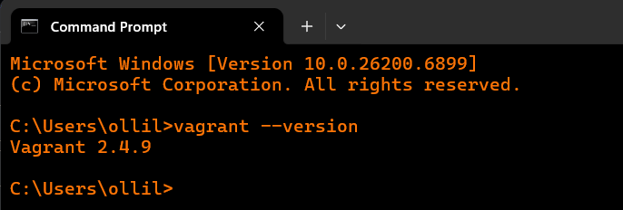
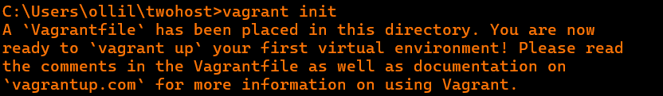
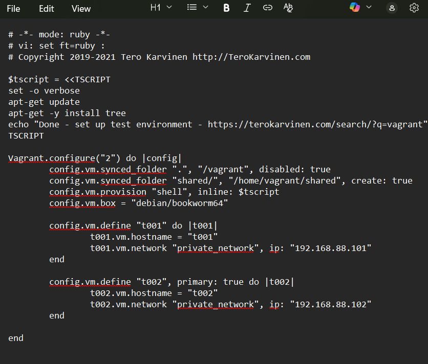
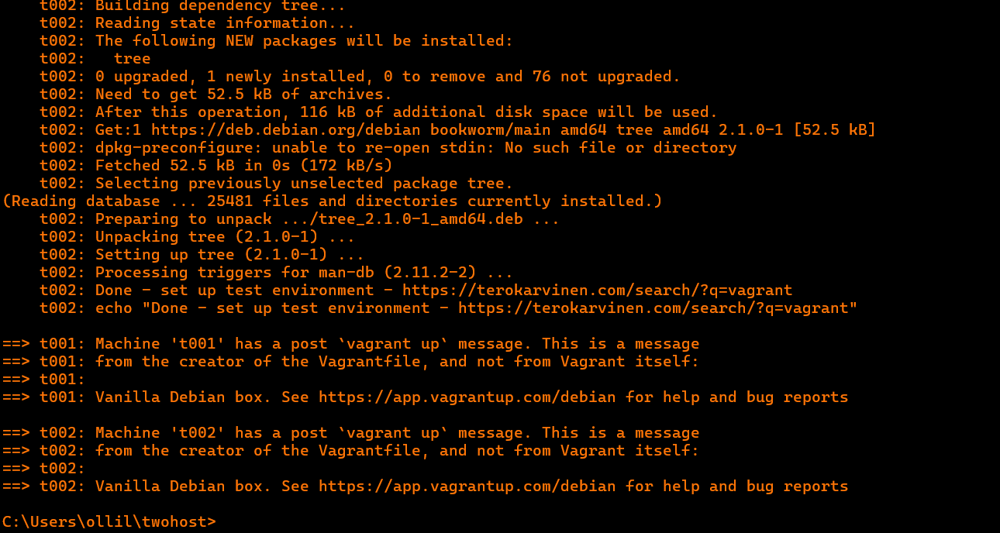
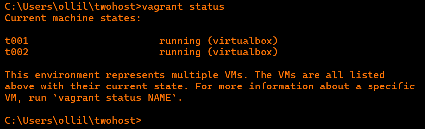
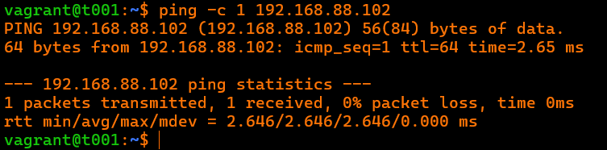
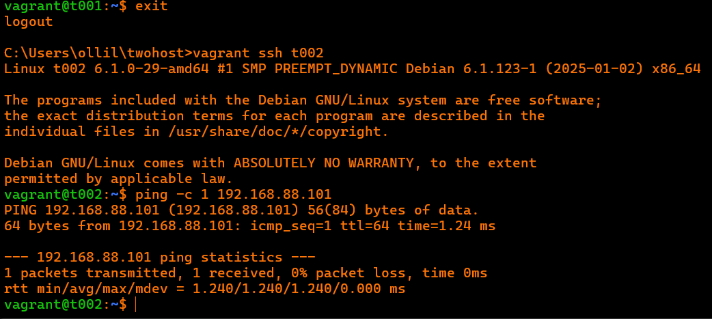

### H3 soitto kotiin

x) Lue ja tiivistä.

**Karvinen 2021: Two Machine Virtual Network With Debian 11 Bullseye and Vagrant (https://terokarvinen.com/2021/two-machine-virtual-network-with-debian-11-bullseye-and-vagrant/)**
- Tämän ohjeen avulla voit perustaa kahden laitteen virtuaaliverkon
- Vanhentunutta 11-bullseye:ta ei enää käytetä
- Vagrantin asennus onnistuu Debianille, ubuntulle, Macille ja Windowsille
- Virtuaalikoneideon "tuhoaminen" onnistuu helposti yhdellä komennolla

**Karvinen 2018: Salt Quickstart – Salt Stack Master and Slave on Ubuntu Linux (https://terokarvinen.com/2018/salt-quickstart-salt-stack-master-and-slave-on-ubuntu-linux/?fromSearch=salt%20quickstart%20salt%20stack%20master%20and%20slave%20on%20ubuntu%20linux)**
- Saltin avulla pystyy komentamaan tuhansia tietokoneita
- Ohjeessa asennetaan Salt master ja slave
- Masterilla pitää hyväksyä minioneiden avaimet

**Karvinen 2023: Salt Vagrant - automatically provision one master and two slaves (https://terokarvinen.com/2023/salt-vagrant/#infra-as-code---your-wishes-as-a-text-file)**
- Infra as Code kohdassa luotiin uusi teidosto infra-as-code
- top-tiedosto määrittelee, mitkä tilat suoritetaan millekin orjalle.

**a) Hello Vagrant! Osoita jollain komennolla, että Vagrant on asennettu (esim tulostaa vagrantin versionumeron). Jos et ole vielä asentanut niitä, raportoi myös Vagrant ja VirtualBox asennukset. (Jos Vagrant ja VirtualBox on jo asennettu, niiden asennusta ei tarvitse tehdä eikä raportoida uudelleen.)**

Tein harjoitukset a-e 6.11.2025 omassa kodissani. Koneenani toimi Lenovon V14 Gen 4 kannettava tietokone. Käytin apunani Tero Karvisen ohjetta Karvinen 2021: Two Machine Virtual Network With Debian 11 Bullseye and Vagrant \
Aloitin lataamalla Vagrantin Windowsille sivulta https://developer.hashicorp.com/vagrant/install. \
Asennus oli helppoa. Piti painaa pari kertaa next ja käynnistää kone uudelleen. Tämän jälkeen avasin Command Promptin ja annoin komennon joka kertoi minulle Vagrantin version.
```
vagrant --version
```


**b) Linux Vagrant. Tee Vagrantilla uusi Linux-virtuaalikone.**
Aloitin luomalla uuden kansion twohost ja siirryin sinne.
```
mkdir twohost
cd twohost
```
Seuraavaksi loin sinne vagran tiedoston komennolla
```
vagran init
```


Tämän jälkeen avasin tiedoston notepadilla ja copy-pastesin Tero Karvisen oheesta Two Machine Virtual Network With Debian 11 Bullseye and Vagrant kohdan **Ready made Vagrantfile for three computers** Korvasin kohdan "debian/bullseye64" --> debian/bookworm64.


Seuraavaksi ajoin komennon
```
vagrant up
```
Asennus lähti käyntiin ja siinä kesti noin 5 minuuttia. Alla näkyy lopputulos


Tarkistin vielä koneiden hostnamet komennolla
```
vagrant status
```



**c) Kaksin kaunihimpi. Tee kahden Linux-tietokoneen verkko Vagrantilla. Osoita, että koneet voivat pingata toisiaan.**

Tässä osiossa testailen pingata kahta konetta jotka loin edellisessä osiossa. \
Otin ssh yhteyden t001 hostiin komennolla
```
vagrant ssh t001
```
Tämän jälkeen pingasin t002 konetta komennolla
```
vagrant@t001$ ping -c 1 192.168.88.102
```
Pingaus onnistui! \

Tämän jälkeen testasin vielä toisinpäin pingata t002 --> t001.
Syötin komennot
```
exit
vagrant ssh t002
ping -c 1 192.168.88.101
```
Tämäkin onnistui! \


### Lähteet:

Karvinen 2021: Two Machine Virtual Network With Debian 11 Bullseye and Vagrant (https://terokarvinen.com/2021/two-machine-virtual-network-with-debian-11-bullseye-and-vagrant/) \
Karvinen 2018: Salt Quickstart – Salt Stack Master and Slave on Ubuntu Linux (https://terokarvinen.com/2018/salt-quickstart-salt-stack-master-and-slave-on-ubuntu-linux/?fromSearch=salt%20quickstart%20salt%20stack%20master%20and%20slave%20on%20ubuntu%20linux) \
Karvinen 2023: Salt Vagrant - automatically provision one master and two slaves (https://terokarvinen.com/2023/salt-vagrant/#infra-as-code---your-wishes-as-a-text-file)
