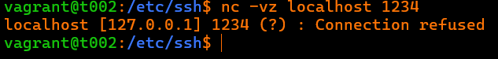
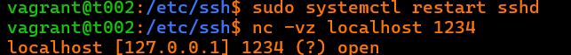
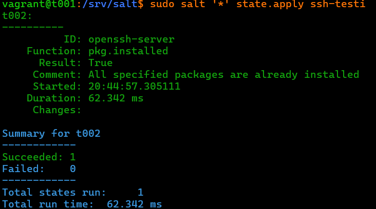
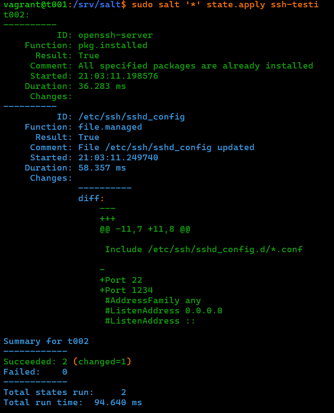
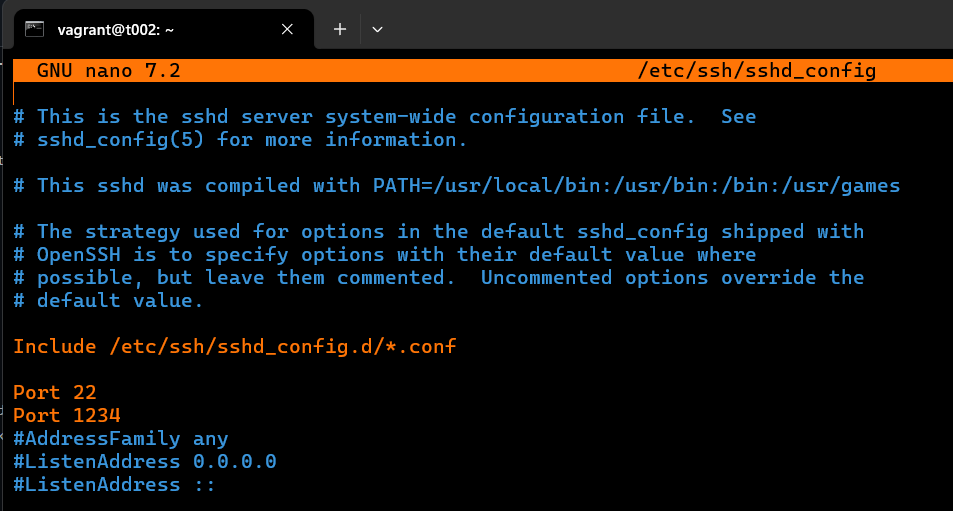
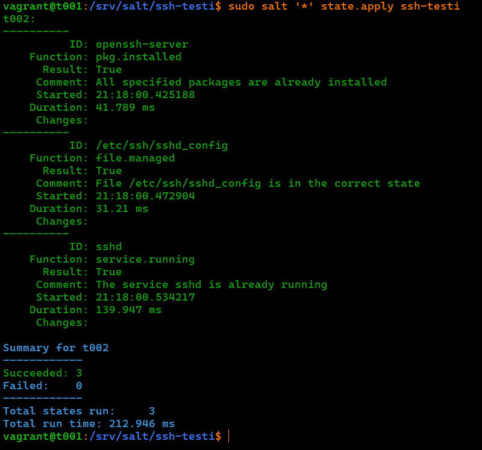
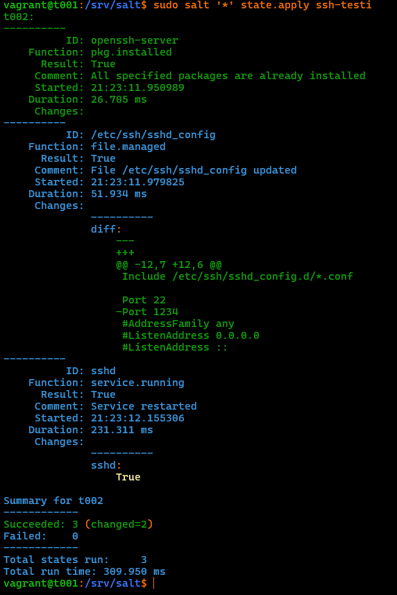

## h4 pkg-file-service

**x) Lue ja tiivistä. (Tässä x-alakohdassa ei tarvitse tehdä testejä tietokoneella, vain lukeminen tai kuunteleminen ja tiivistelmä riittää. Tiivistämiseen riittää muutama ranskalainen viiva.)
Karvinen 2018: Pkg-File-Service – Control Daemons with Salt – Change SSH Server Port**

- Konfiguraatiohallintajärjestelmällä voi hallita valtavia määriä daemoneja.
- Pakettitiedosto on yleisin malli tähän jossa asennetaan ohjelmisto ja korvataan konfiguraatiotiedosto. Lopulta daemon käynnistetään uudelleen.
- Tässä ohjeessa vaihdetaan SSH portti.   

**a) SSHouto. Lisää uusi portti, jossa SSHd kuuntelee.**
Tein harjoituksen virtuaalikoneeseeni kotona 13.11.2025 klo 20:22. Koneenani toimi Lenovon V14 Gen 4 kannettava tietokone. Käytin tässä tehtävässä apunani Tero karvisen ohjetta  Pkg-File-Service – Control Daemons with Salt – Change SSH Server Port. \


Käytän edellisessä h3 soitto kotiin tehtävässä tehtyjä Vagrant virtuaalikoneita t001 ja t002. Käynnistin virtuaalikoneen ja tarkistin saltin version. 
```
vagrant up
```
jotta sain koneeni pystyyn. Tämän jälkeen otin ssh yhteyden minoniin t002.\
Testasin onko portti 1234 auki komennolla
```
nc -vz localhost 1234
```


Vastaukseksi tuli "Connection refused" kuten kuvasta näkyy. \

Tämän jälkeen menin editoimaan sshd_config tiedostoa komennolla
```
sudo nano sshd_config
```
ja lisäsin sinne "Port 1234" \
Tämän jälkeen restarttasin sshd
```
sudo systemctl restart sshd
```
ja kokeilin uudestaan komentoa 
```
nc -vz localhost 1234
```



Nyt onnistui, niinkuin kuvassa näkyi. Tämän jälkeen kävin poistamassa tiedostosta sshd_config kohdan "Port 1234" ja tein uudelleenkäynnistyksen. 

```
sudo systemctl restart sshd
```

Seuraavaksi siirryin master koneelleni komennolla
```
vagrant ssh t001
```
Tein ssh-testi kansion /srv/salt polkuun
```
sudo mkdir /srv/salt/ssh-testi
```
Tämän jälkeen siirryin polkuun /srv/salt/init.sls ja loin/aloin muokkaamaan tiedostoa init.sls
```
sudoedit init.sls
```
Ensiksi asensin openssh-serverin. Tiedostoon tuli tekstiksi: 
```
openssh-server: 
  pkg.installed 
```
 Ajoin tämän jälkeen komennon
```
sudo salt '*' state.apply ssh-testi
```



Tämä onnistui. Succeeded: 1. Ei tullut changed koska ssh oli jo asennettuna minionille. \
Tämän jälkeen tein init.sls tiedostoon seuraavan tekstin edellisen perään: 
```
/etc/ssh/sshd_config: 
  file.managed:
    - source: salt://sshd_config
```
Tämän jälkeen kopioin sshd_configure konfiguraatiotiedoston masteriin joka toimii ns. lähteenä. 
```
sudo cp sshd_config /srv/salt
```
Muutin tiedostosta Portin 22 saataville ja lisäsin Portin 1234. Sitten ajoin 
```
sudo salt '*' state.apply ssh-testi
```
 \
Tämä onnistui! Succeeded 2 ja Changed: 1 eli tiedostoa oli muutettu. Kävin katsomaasa minionilla /etc/ssh/sshd_config tiedostoa ja sinne oli tosiaan tullut Port 22 ja Port 1234 auki. 


Viimeiseksi muokkasin init.sls tiedostoon kaiken perään
```
sshd: 
  service.running: 
   - watch: 
      - file: /etc/ssh/sshd_config 
```
Jos sshd_config tiedostoon tehdään muutoksia niin sshd käynnistyy uudestaan. Tämän jälkeen ajoin komennon.
```
sudo salt '*' state.apply ssh-testi
```
Succeeded 3 mutta mikään ei muuttunut koska tiedostoon ei tehty muutoksia. "The service sshd is already running"


Korjataan tämä poistamalla masterin /srv/salt/sshd_config tiedostosta Port 1234 ja ajetaan komento 
```
sudo salt '*' state.apply ssh-testi
```
 \
Nyt Changed: 2 ja kommentissa lukee "Service restarted".  Seuraavaksi lisätään Portti 1234 masterin /srv/salt/sshd_config tiedostoon ja ajetaan komento uudestaan.
```
sudo salt '*' state.apply ssh-testi
```
Tämän jälkeen testattiin minionilla onko portti 1234 auki
```
nc -vz localhost 1234
```

