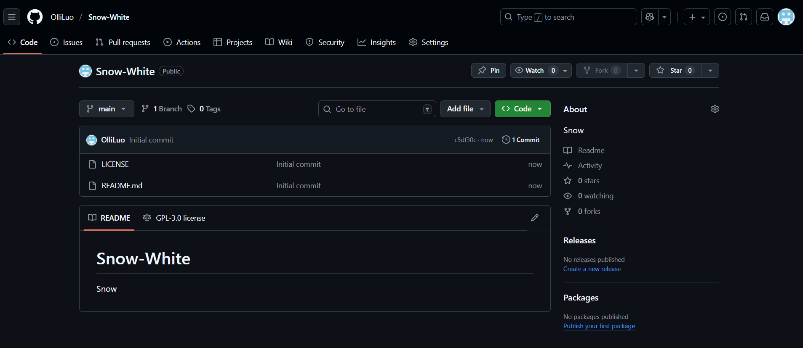
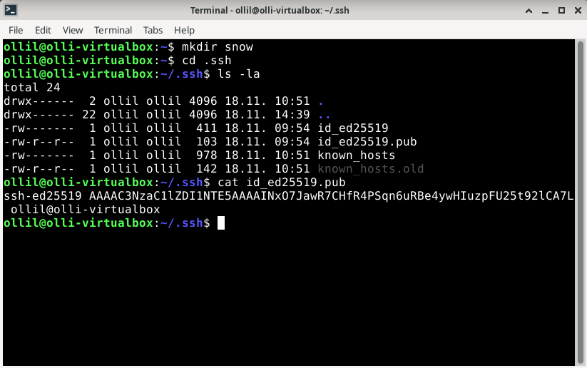
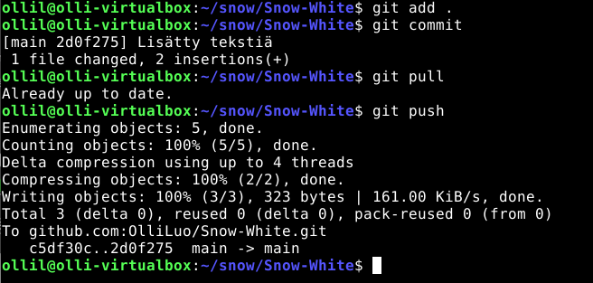
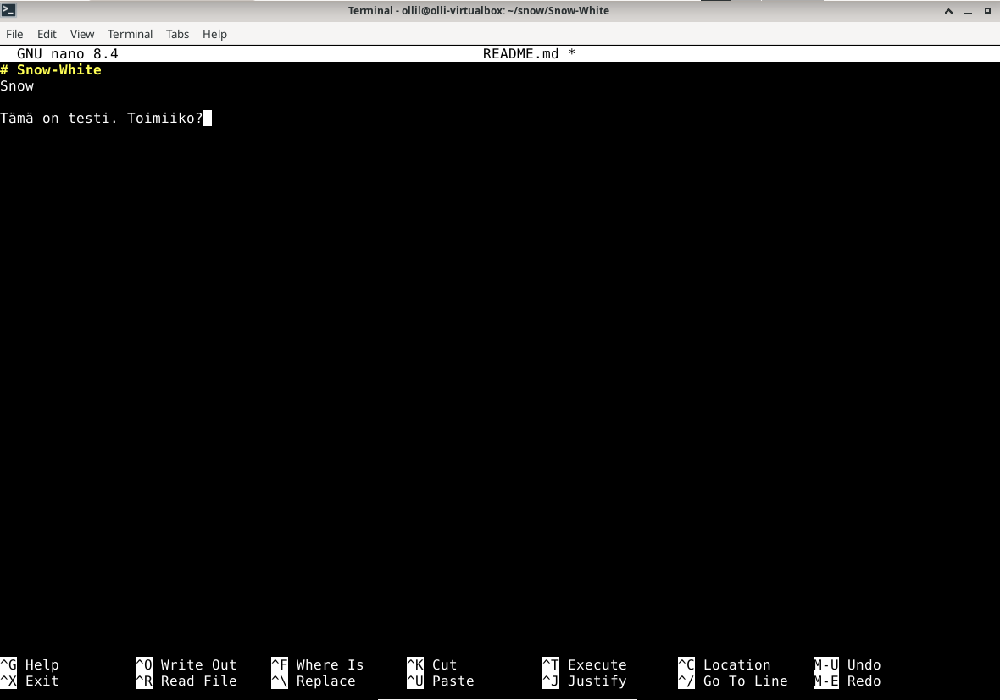
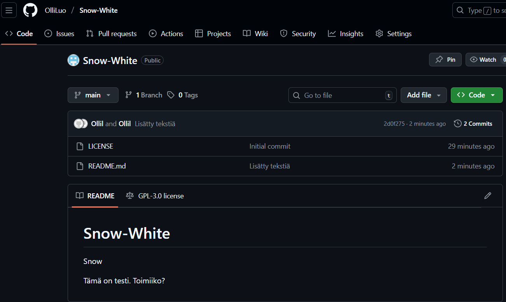

## H5 Toimiva Versio

**x) Lue ja tiivistä. (Tässä x-alakohdassa ei tarvitse tehdä testejä tietokoneella, vain lukeminen tai kuunteleminen ja tiivistelmä riittää. Tiivistämiseen riittää muutama ranskalainen viiva. Kannattaa lisätä mukaan myös jokin oma havainto, idea tai kysymys.)**

**Chacon and Straub 2014: Pro Git, 2ed: 1.3 Getting Started - What is Git?**

**Gitin käyttö on lähinnä 'git add . && git commit; git pull && git push'. Selitä tuon komennon jokainen osa. Käytä apuna itse valitsemiasi lähteitä ja viittaa niihin.**

**Varaston terokarvinen/suolax/ historia, eli loki ja muutokset. Kätevimmin komentokehotteesta 'git clone https://github.com/terokarvinen/suolax.git; cd suolax/; git log --patch --color|less -R'. Wepistäkin saattaa onnistua kliksuttelemalla "Commits".**


**a) Online. Tee uusi varasto GitHubiin (tai Gitlabiin tai mihin vain vastaavaan palveluun). Varaston nimessä ja lyhyessä kuvauksessa tulee olla sana "snow". Aiemmin tehty varasto ei kelpaa. (Muista tehdä varastoon tiedostoja luomisvaiheessa, esim README.md ja GNU General Public License 3)** \
Tein uuden varaston Githubiin nimellä Snow-White. Tein tästä julkisen ja luomisvaiheessa lisäsin README tiedoston sekä GNU General Public License 3. 




**b) Dolly. Kloonaa edellisessä kohdassa tehty uusi varasto itsellesi, tee muutoksia omalla koneella, puske ne palvelimelle, ja näytä, että ne ilmestyvät weppiliittymään.** \
Aloitin tämän luomalla uuden virtuaaliokoneelleni uuden kansion "Snow". Tänne kloonaan varaston. Olin jo tunnilla luonut julkisen avaimen ja liittänyt tämän githubiin. Seuraavaksi hain Snow-White kirjastosta SSH kloonauslinkin: git@github.com:OlliLuo/Snow-White.git 



Ajoin virtuaalikoneessani komennon

```
git clone git@github.com:OlliLuo/Snow-White.git
```



Seuraavaksi tein virtuaalikoneellani muutoksen README tiedostoon. Lisäsin sinne tekstin "Tämä on testi. Toimiiko?"


Tämän jälkeen ajoin komennot
```
git add .
git commit
git pull
git push
```

Tämän jälkeen menin katsomaan githubiin oliko muutos tullut sivulle. Onnistui!




**c) Doh! Tee tyhmä muutos gittiin, älä tee commit:tia. Tuhoa huonot muutokset ‘git reset --hard’. Huomaa, että tässä toiminnossa ei ole peruutusnappia.**


**d) Tukki. Tarkastele ja selitä varastosi lokia. Tarkista, että nimesi ja sähköpostiosoitteesi näkyy haluamallasi tavalla ja korjaa tarvittaessa.**


**e) Suolattu rakki. Aja Salt-tiloja omasta varastostasi. (Salt tiedostot mistä vain hakemistosta "--file-root teronSaltHakemisto". Esimerkiksi 'sudo salt-call --local --file-root srv/salt/ state.apply', huomaa suhteellinen polku.)**


